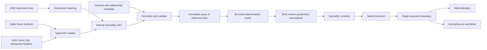

# Sable Query Compiler, Composability, and Observability Refactor

> **Status:** Implementation in progress; Phase 1 is complete in AeroDB (RF-010, RF-011, RF-013, RF-014, RF-015); AeroCMS migration RF-012 remains; RF-002 baseline harness is in progress
> **Last updated:** 2026-07-22
> **Applies to:** `AeroDB.Sable` 0.0.9.x alpha and its current AeroCMS consumer
> **Primary objective:** Replace Sable's disconnected query renderers with one internal, composable SurrealQL compiler while preserving the Marten-like document/session API that already serves AeroCMS well.

## 1. Why This Refactor Exists

Sable already provides a broad document database and event-store API, but its advanced SurrealDB features are implemented through separate terminal builders and string renderers. Ordinary LINQ queries, graph traversal, search/vector queries, spatial queries, live queries, permissions, triggers, and transaction scripts do not currently share a single composable representation.

That creates three problems:

1. Features that SurrealDB supports in one query cannot always be combined through Sable's fluent or LINQ APIs.
2. Each feature grows its own translation, parameterization, validation, and debugging behavior.
3. Query-plan reuse, safe optimization, consistent telemetry, and compiled-query improvements are difficult while the query is represented as partially assembled strings.

Sable is still alpha. This is the appropriate point to correct the architecture instead of preserving unused advanced APIs through permanent compatibility adapters.

## 2. Current Consumer Evidence

A scan of non-legacy AeroCMS production sources on 2026-07-22 found:

| Usage | Approximate call-site count |
|---|---:|
| Ordinary `Query<T>()` | 288 |
| `Store(...)` | 165 |
| `SaveChangesAsync(...)` | 153 |
| Raw query/command execution | 4 |
| `ICompiledQuery<...>` implementations | 46 |
| References to `ISurrealDbQueryable<...>` | 53 |
| Advanced graph/search/spatial/time-series/live builders | 0 |
| Direct use of `SurrealExpressionVisitor` or `SurrealQueryResult` | 0 |
| Calls to the current `ToCommand()` | 0 |

Consequences:

- The document/session and ordinary LINQ contracts are valuable and should remain familiar.
- Compiled-query behavior is a real compatibility boundary and must be ported deliberately.
- Renaming the queryable type will require a mechanical AeroCMS source migration.
- The unused advanced builder contracts may be replaced instead of wrapped.
- Compiler, renderer, and cached-plan implementation types should stop being public.

## 3. Goals

- Preserve the successful Marten-like document, schema, session, and unit-of-work experience.
- Rename the primary query abstraction to `ISableQueryable<T>`.
- Support LINQ syntax and fluent SurrealDB-specific composition through one compiler pipeline.
- Introduce one internal, typed SurrealQL abstract syntax tree (AST).
- Make query construction parameterized by default and validate before execution.
- Preserve and improve both forms of compiled queries.
- Provide safe query inspection through `ToString()` and a structured `ToCommand()` result.
- Enable graph, search/vector, spatial, live-query, authorization, and event-automation composition without raw SurrealQL for supported cases.
- Add vendor-neutral tracing and metrics without adding an OpenTelemetry SDK/exporter dependency to `AeroDB.Sable`.
- Complete and instrument the existing async projection daemon's usable single-node path.
- Establish performance and allocation baselines before replacing the current translator.

## 4. Non-Goals

- Exposing the AST as a public extension API in the first stable version.
- Hiding or removing `RawQueryAsync`; it remains the explicit escape hatch.
- Reproducing every possible SurrealQL construct before the new compiler can ship.
- Collapsing ordinary record links/includes and graph `RELATE` edges into one semantic concept.
- Choosing an OpenTelemetry collector, exporter, or observability vendor for consumers.
- Claiming distributed async-daemon safety before a real ownership/leader-election design exists.
- Maintaining obsolete aliases for unused alpha-only advanced APIs.

## 5. Accepted Public API Decisions

### 5.1 Preserve the established document/session contracts

The following public API shapes remain unless characterization tests reveal an existing correctness defect:

- `StoreOptions.Schema.For<T>()` and related document mapping APIs
- `IQuerySession.Query<T>()`
- `LoadAsync(...)` and load-many APIs
- `IDocumentSession.Store(...)`
- delete APIs
- `IDocumentSession.SaveChangesAsync(...)`
- `RawQueryAsync(...)` and explicit raw command execution
- `ICompiledQuery<TDoc, TOut>` and its shorthand interfaces
- session/store `QueryAsync(...)` execution of compiled-query instances
- batching and unit-of-work entry points

Preservation means source-level shape and user-visible semantics where the type name is not intentionally changed. It does not preserve the current translator, renderer, or query-plan implementation.

### 5.2 Rename the Sable query abstraction

Rename these public abstractions during the alpha refactor:

| Current | Target |
|---|---|
| `ISurrealDbQueryable<T>` | `ISableQueryable<T>` |
| `SurrealDbQueryable<T>` | `SableQueryable<T>`; make internal if practical |
| `ILinkedSurrealDbQueryable<...>` | `ILinkedSableQueryable<...>` |
| `IIncludableSurrealDbQueryable<...>` | `IIncludableSableQueryable<...>` |
| `SurrealDbQueryableExtensions` | `SableQueryableExtensions` |

`IQuerySession.Query<T>()` continues to exist, but its declared return type becomes `ISableQueryable<T>`.

`ICompiledQuery<TDoc, TOut>.QueryIs()` becomes:

```csharp
Expression<Func<ISableQueryable<TDoc>, TOut>> QueryIs();
```

Do not ship an `ISurrealDbQueryable<T>` compatibility alias. Update AeroDB tests, samples, integrations, and AeroCMS in the same migration window.

SurrealDB- or SurrealQL-specific names remain appropriate for language and transport concepts such as raw SurrealQL, the SurrealQL renderer, and SurrealDB geometry/function mappings.

### 5.3 Query inspection

Introduce a structured command representation:

```csharp
public sealed record SableCommand(
    string CommandText,
    IReadOnlyDictionary<string, object?> Parameters)
{
    public override string ToString() => CommandText;
}
```

Target behavior:

- `ISableQueryable<T>.ToCommand()` returns `SableCommand`.
- The concrete Sable queryable overrides `object.ToString()` and returns parameterized SurrealQL.
- `ToString()` and `ToCommand()` never execute or connect to SurrealDB.
- `ToString()` never inlines parameter values.
- Parameters and secrets are not automatically written to logs or telemetry.
- `CompiledQuery<T>.ToString()` returns its parameterized compiled template.
- Marten-style consumer-defined `ICompiledQuery<TDoc, TOut>` objects use `session.ToCommand(compiledQuery)` for the exact schema- and session-aware command.

Changing the current `ToCommand()` return type from `string` to `SableCommand` is accepted during alpha. AeroCMS currently has no call sites.

### 5.4 Hide compiler implementation types

The following are implementation details and should become internal or be replaced by internal equivalents:

- `SurrealExpressionVisitor`
- `SurrealQueryResult`
- `CompiledPlan`
- `CompiledQueryPlanner`
- `CompiledQueryProvider<T>`
- AST nodes
- normalization and validation passes
- SurrealQL renderer and parameter binder

Public diagnostics should expose stable command/diagnostic DTOs, not compiler internals.

## 6. Target Compiler Architecture



### 6.1 Layer responsibilities

| Layer | Responsibility | Must not do |
|---|---|---|
| LINQ lowering | Convert C# expression trees into typed nodes | Render strings or execute |
| Fluent builders | Add typed SurrealDB-specific nodes | Maintain a separate renderer |
| AST | Represent query/statement meaning | Expose transport or session objects |
| Normalizer | Canonicalize equivalent shapes and combine safe clauses | Change observable query semantics |
| Validator | Enforce SurrealQL and Sable invariants | Silently fall back to client evaluation |
| Planner | Resolve schema, relationships, terminal/result shape, and parameter slots | Capture mutable session state |
| Binder | Supply runtime values, tenancy, soft-delete, and other policies | Inline values into query text |
| Renderer | Produce deterministic SurrealQL and parameter metadata | Access the database |
| Executor | Execute once, trace once, and materialize | Re-translate the expression tree |

### 6.2 Conceptual AST node families

Exact names may change during implementation, but the model must cover:

- Statements: select, create, update, upsert, delete, relate, remove-relation, define, transaction/script, live-select.
- Sources: table, record, view, subquery, variable, graph traversal.
- Expressions: field, parameter, literal, binary/unary operation, function call, array/object, conditional, subquery.
- Query clauses: projection, filter, grouping, ordering, limit/start, fetch/include, split, timeout, explain.
- SurrealDB-specific expressions: record IDs, graph paths, full-text match/score, vector KNN/distance, RRF, geometry predicates, temporal functions.
- Script constructs: variables, conditional flow, returns, transaction boundaries.
- Definition constructs: scopes/accesses/tokens, table events, permissions, indexes/analyzers where included in scope.

The AST must be internal, typed, deterministic to render, and incapable of representing an unparameterized runtime value by accident.

### 6.3 The expression visitor is not eliminated

The existing expression visitor's role is split and narrowed:

```text
Current:  expression tree -> string fragments/SurrealQueryResult -> SurrealQL
Target:   expression tree -> typed AST nodes -> normalized plan -> SurrealQL
```

Expression visitors remain an appropriate implementation technique for parsing LINQ. They stop being the query representation and stop rendering strings directly.

Fluent structural methods add AST nodes directly. Lambda arguments used by fluent methods still pass through expression lowering.

### 6.4 Preserve relationship semantics

Maintain separate node families and validation rules for:

1. Provider-neutral document relationships: `HasOne`, `HasMany`, `Link`, `Join`, `Include`, `Fetch`, reverse include, and hydration metadata.
2. SurrealDB graph edges: `RELATE`, edge records, directional traversal, paths, depth, and graph-specific projection.

They may share field, parameter, predicate, projection, renderer, and materialization infrastructure. They are not interchangeable domain concepts.

## 7. Compiled Query Design

Sable must continue supporting both compiled-query forms:

1. `store.CompileQuery<T>(...)` returning Sable's concrete compiled query.
2. Marten-style `ICompiledQuery<TDoc, TOut>` classes with runtime properties and `QueryIs()`.

### 7.1 Target compiled plan

A compiled plan contains:

- An immutable normalized AST.
- Stable runtime parameter slots.
- Precomputed property accessors or generated binders.
- Schema/relationship identity used to validate cache reuse.
- Terminal/result-shape information.
- A pre-rendered SurrealQL template when the shape is fully stable.

Execution binds current property values, applies session policies structurally, renders only when required, and executes the resulting `SableCommand`.

### 7.2 Remove sentinel-value coupling

The current interface-based planner discovers parameter mappings by assigning sentinel values and matching them after expression translation. Replace this with explicit parameter-slot nodes or an equivalent deterministic binding model. Do not key a compiled plan on runtime values.

### 7.3 Cache rules

- Cache by query type/shape plus relevant finalized schema identity.
- Do not retain arbitrary runtime values in cache keys.
- Do not use an unbounded cache for arbitrary ad hoc LINQ expression instances.
- Do not clone the complete AST for every execution.
- Tenant and soft-delete values are runtime bindings, not cached constants.
- Cache invalidation rules must be explicit and tested.

## 8. Performance Expectations and Guardrails

The AST is an enabling architecture, not a performance guarantee.

Expected opportunities:

- Translate and validate a reusable query shape once.
- Pre-render stable command templates.
- Reduce repeated string concatenation and metadata resolution.
- Combine advanced operations into one server-side query and reduce round trips.
- Push filters, projections, ordering, and pagination to SurrealDB.
- Remove redundant clauses and reject contradictory/invalid composition early.

Expected impact:

| Scenario | Expected benefit |
|---|---|
| Simple CRUD or one-predicate query | Small; network/database latency dominates |
| Large LINQ composition | Moderate client CPU/allocation opportunity |
| Compiled/repeated query | Strongest client-side opportunity |
| Previously multi-query advanced workflow | Potentially large end-to-end improvement from fewer round trips |

Guardrails:

- Do not render after each fluent call.
- Do not introduce copy-on-every-node behavior that becomes quadratic for large queries.
- Prefer immutable finalized plans with structural sharing or a builder/freeze boundary.
- Benchmark translation separately from database execution.
- Record allocations as well as elapsed time.
- Do not claim a performance improvement until before/after results exist.

Required benchmark cases:

- Simple `Where` plus terminal operation.
- Projection, ordering, skip, and take.
- A large query with at least 20 composed clauses/expressions.
- Relationship include/fetch/link query.
- Hybrid text/vector query.
- Graph plus filter/projection query.
- Ad hoc execution versus both compiled-query forms.
- Cold-plan and warm-plan measurements.

### 8.1 Pre-AST development baseline (2026-07-22)

The first reproducible compiler-only harness lives in
`benchmarks/AeroDB.Benchmarks/QueryCompilerBenchmarks.cs`. It separates expression
translation, rendering, concrete compiled-query construction, and warm
interface-plan lookup. `MemoryDiagnoser` records allocations. These are local
`ShortRun` development measurements on .NET 10.0.9, not release claims:

| Operation | Mean | Allocated |
|---|---:|---:|
| Translate with a new visitor | 2.398 us | 3.61 KB |
| Translate with a reused visitor | 2.317 us | 2.96 KB |
| Render a translated query | 248.33 ns | 872 B |
| Translate and render | 2.326 us | 4,128 B |
| Build a concrete compiled query | 8.100 ms | 11,552 B |
| Resolve a cached interface compiled plan | 16.19 ns | 24 B |

Reproduce the validation and short baseline from
`benchmarks/AeroDB.Benchmarks`:

```powershell
dotnet build Dali.Benchmarks.csproj -c Release
dotnet run -c Release --no-build -- --filter "*QueryTranslation*" "*QueryCompilerPipeline*" --job Dry --noOverwrite
dotnet run -c Release --no-build -- --filter "*QueryTranslation*" "*QueryCompilerPipeline*" --job Short --noOverwrite
```

Remaining RF-002 coverage is the simple-terminal, large-composition,
relationship, hybrid-search, and graph cases. The current advanced builders do
not expose a render-only seam, so their compiler-only benchmarks should be added
as each builder is moved onto the AST instead of timing database execution or a
mocking framework.

## 9. OpenTelemetry Design

### 9.1 Dependency boundary

`AeroDB.Sable` emits telemetry using only .NET runtime primitives:

- `System.Diagnostics.ActivitySource`
- `System.Diagnostics.Activity`
- `System.Diagnostics.Metrics.Meter`
- `Microsoft.Extensions.Logging`

Do not add `OpenTelemetry.*` SDK, instrumentation, or exporter packages to `AeroDB.Sable`.

The consuming application decides whether and where to collect/export telemetry. If a convenience `AddSableInstrumentation()` extension requires OpenTelemetry builder types, place it in an optional integration package rather than Sable core.

Stable source names:

```csharp
public static class SableTelemetry
{
    public const string ActivitySourceName = "AeroDB.Sable";
    public const string MeterName = "AeroDB.Sable";
}
```

### 9.2 Query and persistence spans

Instrument the execution boundary, not individual fluent calls or AST nodes.

Candidate operations:

- query/command execution
- `SaveChangesAsync`
- batch execution
- compiled-plan construction
- event append/fetch
- projection load/execute/commit
- projection rebuild

The exact span names and tags must be defined once and treated as a stable observability contract.

### 9.3 Metrics

Candidate instruments:

- command/query duration histogram
- command/query error counter
- save-changes duration and operation count
- compiled-plan build count/duration and cache hit/miss counters
- appended-event counter
- projection processed-event counter
- projection lag histogram or observable gauge
- projection failure/skipped-event counter
- active projection-shard gauge
- projection batch load/execute/commit duration

### 9.4 Data safety and cardinality

- SurrealQL statement text is disabled by default.
- Never emit parameter values automatically.
- Never emit secret, token, password, embedding payload, or document content values.
- Avoid tenant IDs, record IDs, user IDs, and arbitrary table/index names as metric dimensions.
- Bounded projection/shard names may be metric dimensions after validation.
- Errors set activity status and correlate through logs; do not duplicate large exception payloads across tags.

The existing `OpenTelemetryOptions` is a starting point, not proof of instrumentation. Refactor it into the final options model and connect every option to tested behavior.

## 10. Async Daemon: Current State and Target

Sable already contains:

- `AsyncDaemon`
- one `ProjectionShard` per async/live projection
- polling through the event store
- persisted per-projection progress in `mt_projection_progress`
- projection health records and health checks
- rebuild support
- `ProjectionCoordinator : IHostedService`
- `ProjectionLifecycle.Async`
- event subscriptions and change listeners

Current gaps discovered in live code:

- No production code constructs and assigns `DocumentStore.Daemon`.
- `AddAsyncDaemon(DaemonMode)` currently returns the service collection without activating anything.
- `ProjectionCoordinator` can only start a daemon that was assigned elsewhere.
- Actual daemon lag remains zero rather than comparing projection progress with a database/event high-water position.
- There is no distributed ownership/leader election equivalent to Marten HotCold mode.
- Checkpoint advancement across pages containing no matching event types must be audited.
- Cancellation, commit/checkpoint atomicity, retries, poison events, and multi-node behavior require explicit tests before production claims.

### 10.1 Target single-node behavior

- `AddAsyncDaemon(DaemonMode.Solo)` constructs and owns exactly one daemon per store.
- The host starts and stops it through `IHostedService` without a public mutable `DocumentStore.Daemon` setter.
- Every shard resumes from a persisted checkpoint.
- Checkpoints advance across all examined events, including pages with no matching events.
- Projection writes and checkpoint advancement have a documented atomicity model.
- Failures retry according to an explicit policy and expose health/telemetry.
- `WaitForNonStaleData` uses real high-water and lag semantics.

### 10.2 Distributed mode decision gate

Do not treat `DaemonMode.HotCold` as implemented until Sable has a real SurrealDB-compatible ownership mechanism and failure model. Until that decision is approved, HotCold must fail clearly rather than silently behaving as Solo or doing nothing.

## 11. SurrealDB Capability Outcomes

The original comparison used the current feature examples presented at `https://surrealdb.com/`. These are product scenarios, not all single language operators. The refactor targets the underlying composable capabilities:

| SurrealDB scenario | Required Sable capability |
|---|---|
| Multi-model query | Documents, record links, graph traversals, subqueries, projections, and functions in one plan |
| ACID transactions | Typed multi-statement transaction/script composition over the existing session unit of work |
| Built-in auth | Typed scope/access/token/sign-up/sign-in and permission statement builders |
| Hybrid RAG | Full-text ranking, vector KNN/distance, RRF fusion, filtering, projection, and paging |
| Graph RAG | Search result or record source feeding graph traversal and contextual projection |
| Context expansion | Bounded graph traversal and related-record expansion in a composed query |
| Knowledge graphs | Typed edge writes, traversal, path projection, filtering, and graph materialization |
| Agent memory | Composable temporal, vector, graph, and metadata filters |
| Conversational memory | Ordered temporal retrieval, participant/session filters, vector search, and paging |
| Live queries | A normal validated select plan wrapped as `LIVE SELECT`, with bounded subscription delivery |
| Recommendations | Vector or graph candidate generation, scoring/ranking, filtering, and projection |
| Geospatial queries | Geometry predicates, distance expressions, distance ordering, filtering, and paging |
| Event-driven automation | Typed table-event definitions and safe conditional/action expressions |

Each scenario must have at least one public fluent example, a generated-SurrealQL contract test, and an integration test where SurrealDB supports the required behavior in the test environment.

## 12. Implementation Plan

Status convention: unchecked means not started. Mark a task complete only after its listed verification passes.

### Phase 0: Characterize and Baseline

#### [x] RF-001: Freeze existing query-generation behavior

**Description:** Add focused golden/structural tests for ordinary LINQ, terminal operations, tenancy, soft delete, projections, grouping, fetch/include/link, raw queries, and current compiled-query behavior.

**Acceptance criteria:**

- Existing supported query shapes have deterministic expected SurrealQL and parameter assertions.
- Policy-injected predicates and relationship state are covered.
- Tests distinguish intended behavior from known defects that should not be preserved.

**Verification:** Focused `AeroDB.Tests` query and compiled-query suites pass.

**Dependencies:** None.

**Completed 2026-07-22:** Added exact compiler-boundary tests for ordinary LINQ,
parameters, projections, grouping, Count/Any terminal rewrites, policy injection,
and compiled-plan templates. Existing exact relationship/FETCH tests and the raw,
tenancy, soft-delete, projection, grouping, and compiled-query execution suites
remain the behavioral coverage. The tests explicitly mark CLR-named grouping keys
and the inlined tenant predicate as migration tripwires rather than desired AST
contracts.

#### [ ] RF-002: Add compiler microbenchmarks

**Description:** Extend the existing benchmark project with cold/warm translation, rendering, allocations, and compiled-query cases listed in Section 8.

**Acceptance criteria:**

- Baseline results can be reproduced locally.
- Translation and database execution are measured separately.
- Results include elapsed time and allocated bytes.

**Verification:** Benchmark project builds and a short/dry benchmark run completes.

**Dependencies:** None.

**In progress 2026-07-22:** Repaired the stale benchmark project reference and
alpha type names, then added six allocation-aware cold/warm translation,
rendering, and compiled-plan cases. Release build, two dry validations, and one
six-case `ShortRun` completed. Keep this task open for the remaining Section 8
composition cases.

#### [x] RF-003: Define public contract examples

**Description:** Create compile-time and command-generation contract tests for the intended LINQ/fluent syntax covering the SurrealDB capability matrix.

**Acceptance criteria:**

- Every scenario in Section 11 has a proposed public example.
- Examples use no raw SurrealQL unless explicitly testing the escape hatch.
- Unsupported scenarios fail with an explicit pending test or documented decision, not a misleading passing stub.

**Verification:** Contract project/test files compile as each slice is enabled.

**Dependencies:** None.

**Completed 2026-07-22:** Added
[`spec/sable-query-contracts.md`](spec/sable-query-contracts.md) with proposed
fluent/query syntax for all 13 capability scenarios, expected command shapes,
current-versus-target status, and the staged contract-test rollout. The examples
are documented as pending rather than compiled against placeholder APIs. The
public composition decisions were approved at Checkpoint A before RF-010.

### Checkpoint A: Baseline Approved

- [x] Existing behavior is characterized.
- [x] Benchmark baseline is recorded.
- [x] Public examples have been reviewed before compiler implementation begins.

### Phase 1: Public API Cleanup

#### [x] RF-010: Rename the core queryable contracts

**Description:** Rename the primary queryable and related linked/includable interfaces and implementation types inside `AeroDB.Sable`.

**Acceptance criteria:**

- `IQuerySession.Query<T>()` returns `ISableQueryable<T>`.
- No public `ISurrealDbQueryable` aliases remain.
- Core project builds before downstream migrations.

**Verification:** `AeroDB.Sable` builds with zero old-name references in production source.

**Dependencies:** RF-001.

**Completed 2026-07-22:** Renamed the core queryable, linked, includable, concrete,
and extension types to their Sable names without a compatibility alias. A direct
`AeroDB.Sable.csproj` build passed and production C# contains no old queryable
name references. The one build warning is the pre-existing nullable warning in
`JsonElementCborConverter.cs`.

#### [x] RF-011: Migrate AeroDB integrations, tests, and samples

**Description:** Update dependent projects, compiled-query definitions, tests, samples, XML documentation, and diagnostic messages to the new queryable name.

**Acceptance criteria:**

- Repository-owned projects contain no unintended old-name references.
- Compiled-query tests cover the renamed `QueryIs()` signature.
- No semantic query changes are mixed into the mechanical rename.

**Verification:** `dotnet build src/AeroDB.slnx` and focused tests pass.

**Dependencies:** RF-010.

**Completed 2026-07-22:** Migrated repository-owned projects, benchmarks,
compiled-query definitions, tests, XML comments, and diagnostics to the Sable
queryable names. No old queryable identifiers remain in repository-owned C#.
`dotnet build src/AeroDB.slnx --no-restore` passed with zero errors; its three
`NU1701` warnings in `AeroDB.Analyzers.Tests` pre-date this work. Generated API
reference pages were not hand-edited and will be regenerated from the renamed
public surface by the documentation pipeline.

#### [ ] RF-012: Migrate AeroCMS

**Description:** Update AeroCMS's queryable casts and 46 compiled-query definitions in lockstep with the Sable rename.

**Acceptance criteria:**

- Non-legacy AeroCMS has no `ISurrealDbQueryable` references.
- Existing compiled-query behavior remains unchanged.
- The migration contains no compatibility aliases.

**Verification:** Build the relevant AeroCMS solution/projects and run its Sable-dependent focused tests.

**Dependencies:** RF-011.

**Integration note 2026-07-22:** The AeroCMS consumer migration is 15
repository-owned C# files. AeroCMS currently builds against its own AeroDB
submodule at commit `47fb2394`, while this refactor is still uncommitted in the
primary AeroDB working tree. AeroCMS also has unrelated in-progress changes.
Leave RF-012 pending until the refactor is committed and that submodule can be
advanced; do not leave AeroCMS source uncompilable against its current gitlink.

#### [x] RF-013: Introduce `SableCommand` and debugger-friendly rendering

**Description:** Replace the string-only `ToCommand()` contract, add safe `ToString()` behavior, and add session-aware compiled-query command inspection.

**Acceptance criteria:**

- Command text and parameters are separately inspectable.
- `ToString()` never executes and never inlines values.
- Queryable, concrete compiled, and interface-based compiled-query inspection are tested.

**Verification:** Focused diagnostic/command tests pass; AeroCMS has no source break from the return-type change.

**Dependencies:** RF-010.

**Completed 2026-07-22:** Added the immutable, snapshotting `SableCommand`
descriptor and non-executing inspection for Sable queryables, concrete compiled
queries, and interface-based compiled queries. `ToString()` returns only the
parameterized command text. Focused query/compiler/relationship tests passed
118/118. A final serialized `AeroDB.Tests` run after RF-014 passed 2,062/2,062;
`AeroDB.AspNetIdentity.Tests` passed 136/136.

#### [x] RF-014: Internalize leaked compiler types

**Description:** Remove compiler/planner/provider implementation types from the supported public surface, introducing stable diagnostic DTOs where required.

**Acceptance criteria:**

- Public consumers do not need AST, visitor, renderer, or plan implementation types.
- Tests use internals access only where implementation-level coverage is intentional.
- Public XML documentation no longer advertises compiler internals.

**Verification:** Public API review and build pass.

**Dependencies:** RF-013.

#### [x] RF-015: Preserve CLR identity types as native record keys

**Description:** Stop converting document identities to strings before record
construction. A `long`/`int` identity is a native numeric SurrealDB record key;
a `string` identity remains a string key even when its contents are numeric.

**Acceptance criteria:**

- Store, insert, update, load, existence checks, load-many, delete, hard-delete,
  patch, bulk insert, projections, batches, concurrency checks, and graph
  endpoints use one type-aware identity resolver.
- Existing session method signatures remain unchanged. String overloads infer
  the declared document identity type; a string-identity document never parses
  numeric-looking text as a number.
- Source-generated metadata exposes the raw CLR identity and its declared type
  instead of a stringified persistence identity.
- No persisted-data compatibility shim or dual-read path is added. Alpha
  consumers recreate their databases.

**Verification:** Unit tests distinguish `product:42` from
`product:\`42\``; real SurrealDB 3.2 tests inspect `record::id(id)` with
`type::is_int`/`type::is_string`, including a Snowflake-sized value above the
JavaScript safe-integer range, bulk insert, transaction patching, and graph
endpoints.

**Dependencies:** RF-011.

**Completed 2026-07-22:** Internalized `SurrealExpressionVisitor`,
`SurrealQueryResult`, `SurrealQueryProvider`, `CompiledPlan`,
`CompiledQueryPlanner`, and `CompiledQueryProvider<T>`. `SableCommand` remains the
stable public diagnostic DTO. Existing test, ML, and benchmark implementation
coverage uses explicit `InternalsVisibleTo` access. The complete solution builds,
and the public-surface plus query inspection/compiled-query focused tests passed
23/23.

### Checkpoint B: Public Surface Ready

- [ ] Rename is complete in AeroDB and AeroCMS.
- [ ] Query inspection is stable and parameter-safe.
- [ ] Implementation types are no longer accidental contracts.

### Phase 2: AST and Command Foundation

#### [ ] RF-020: Implement core expression and clause nodes

**Description:** Introduce the smallest typed node model needed for existing select queries without changing execution.

**Acceptance criteria:**

- Nodes distinguish fields, parameters, literals, operators, functions, projections, filters, ordering, and paging.
- Runtime values require parameter nodes by default.
- Nodes are internal and testable without a database.

**Verification:** Node invariant and construction tests pass.

**Dependencies:** Checkpoint B.

#### [ ] RF-021: Implement parameter binding and `SableCommand`

**Description:** Bind runtime slots into a separate parameter dictionary and produce an immutable command descriptor.

**Acceptance criteria:**

- Deterministic parameter names are generated.
- Values are never concatenated into command text.
- Rebinding a plan does not mutate the cached plan.

**Verification:** Parameterization, concurrency, and sensitive-value tests pass.

**Dependencies:** RF-020.

#### [ ] RF-022: Implement the deterministic SurrealQL renderer

**Description:** Render the initial select AST to canonical SurrealQL.

**Acceptance criteria:**

- Equivalent normalized plans render identically.
- Renderer performs no metadata lookup or database access.
- Golden tests cover simple and complex select commands.

**Verification:** Renderer contract tests pass.

**Dependencies:** RF-020, RF-021.

#### [ ] RF-023: Implement normalization and validation passes

**Description:** Add explicit passes for clause ordering, predicate combination, incompatible constructs, required source/result metadata, and safe constant handling.

**Acceptance criteria:**

- Invalid compositions fail before execution with actionable errors.
- Normalization preserves parameter identity and query semantics.
- No client-evaluation fallback is introduced.

**Verification:** Normalization/validation matrix tests pass.

**Dependencies:** RF-022.

### Checkpoint C: Compiler Foundation

- [ ] Initial AST cannot accidentally inline runtime values.
- [ ] Renderer is deterministic.
- [ ] Invalid plans fail before transport execution.

### Phase 3: Port Ordinary LINQ and Policies

#### [ ] RF-030: Lower basic LINQ into the AST

**Description:** Port source/table resolution, predicates, ordering, skip/take, and basic terminal operations.

**Acceptance criteria:**

- Existing public LINQ syntax is unchanged.
- Baseline command output remains equivalent except approved corrections.
- Current terminal operations use the new execution pipeline.

**Verification:** RF-001 basic query tests pass against the AST path.

**Dependencies:** Checkpoint C.

#### [ ] RF-031: Port projections, grouping, aggregates, and functions

**Description:** Lower projection shapes, group operations, aggregates, and existing Surreal function mappings into typed nodes.

**Acceptance criteria:**

- Materialization shape is carried independently from command rendering.
- Aggregate and grouped queries retain their current public API.
- Unsupported projection shapes fail explicitly.

**Verification:** Projection/view/aggregate/function suites pass.

**Dependencies:** RF-030.

#### [ ] RF-032: Port tenancy, soft-delete, encryption, and query policies

**Description:** Apply cross-cutting policies as structural predicates or validated plan transformations.

**Acceptance criteria:**

- Policy values are parameters.
- Policies apply identically to normal, compiled, batch, and inspected commands.
- Encrypted-operation guards remain fail closed.

**Verification:** Tenant, soft-delete, encryption, compiled, and `ToCommand()` policy tests pass.

**Dependencies:** RF-030.

#### [ ] RF-033: Port document relationship composition

**Description:** Move fetch/include/link/join/reverse-include state into the shared plan without conflating it with graph edges.

**Acceptance criteria:**

- Chaining LINQ methods cannot lose relationship state.
- Forward/reverse hydration retains stable identity matching.
- Compiled plans consume finalized relationship metadata.

**Verification:** Relationship, fetch/include, hydration, and compiled relationship suites pass.

**Dependencies:** RF-031, RF-032.

### Checkpoint D: Existing Query Parity

- [ ] AeroCMS CRUD/basic query behavior passes without compatibility shims.
- [ ] All ordinary query execution uses the AST pipeline.
- [ ] No old flat query result is required by production code.

### Phase 4: Compiled Queries and Caching

#### [ ] RF-040: Port concrete `CompileQuery<T>`

**Description:** Cache an immutable compiled AST plan and parameter slots rather than `SurrealQueryResult`.

**Acceptance criteria:**

- Expression walking occurs once per compilation.
- Repeated execution binds values without cloning the complete AST.
- `ToString()` and `ToCommand()` use the same compiled plan as execution.

**Verification:** Concrete compiled-query tests and cold/warm benchmarks pass.

**Dependencies:** Checkpoint D.

#### [ ] RF-041: Port interface-based compiled queries

**Description:** Replace sentinel matching with explicit binding slots/accessors while retaining `ICompiledQuery<TDoc, TOut>`.

**Acceptance criteria:**

- All current terminal/result shapes continue to work.
- Schema-specific relationship plans are cached safely.
- Runtime property values never enter cache keys.

**Verification:** CompiledQueryInterfaceTests and record-relationship compiled tests pass.

**Dependencies:** RF-040.

#### [ ] RF-042: Port batch and JSON compiled-query consumers

**Description:** Make batched queries and JSON streaming consume the same compiled plan and command representation.

**Acceptance criteria:**

- Batched compiled queries remain single round trip where currently promised.
- JSON result paths do not independently translate queries.
- Command inspection matches executed batch components.

**Verification:** Batched query and JSON streaming suites pass.

**Dependencies:** RF-041.

### Checkpoint E: Compiled Query Parity

- [ ] Both compiled-query forms use the AST.
- [ ] AeroCMS compiled-query tests pass.
- [ ] Cold/warm benchmark comparison is recorded.

### Phase 5: Writes, Transactions, and Scripts

#### [ ] RF-050: Add document write statement nodes

**Description:** Represent create, update/upsert, delete, and content/merge operations with typed statements.

**Acceptance criteria:**

- Existing `Store`, delete, and session APIs are unchanged.
- Dictionary/object keys and values are safely represented.
- Write rendering preserves current identity and concurrency behavior.

**Verification:** DocumentSession write, literal escaping, identity, and concurrency tests pass.

**Dependencies:** Checkpoint C.

#### [ ] RF-051: Port `SaveChangesAsync` transaction composition

**Description:** Build one typed transaction/script plan from pending operations and render it at commit.

**Acceptance criteria:**

- Pending operations commit atomically under the existing contract.
- Failure does not partially clear or corrupt unit-of-work state.
- Telemetry can represent one save span plus optional operation details.

**Verification:** Unit-of-work, transaction, event/outbox, and failure-path tests pass.

**Dependencies:** RF-050.

#### [ ] RF-052: Port patch, relate, and advanced write composition

**Description:** Move patching, record links, graph edge writes, and applicable batch statements onto shared nodes/rendering.

**Acceptance criteria:**

- Record links and graph edges remain distinct.
- Predicate/value translation is parameterized.
- Current public APIs either remain or are intentionally replaced before beta.

**Verification:** Patch, relation, graph write, and batch suites pass.

**Dependencies:** RF-051.

### Phase 6: Composable Advanced Read Queries

#### [ ] RF-060: Integrate full-text, vector, and hybrid search

**Description:** Replace the terminal search builder with composable search/ranking nodes supporting filters, projections, ordering, paging, and RRF.

**Acceptance criteria:**

- Text and vector inputs can be used independently or fused.
- Search composes with normal LINQ filters and projections.
- Existing unused search builder is removed rather than adapted indefinitely.

**Verification:** Search/vector/RRF command and integration tests pass.

**Dependencies:** Checkpoint D.

#### [ ] RF-061: Integrate graph traversal and graph projection

**Description:** Replace the terminal graph builder with traversal nodes that can participate in query sources, projections, predicates, subqueries, and result shaping.

**Acceptance criteria:**

- Direction, edge type, depth/path, intermediate/origin, and graph filtering remain typed.
- Graph traversal composes with search, projection, paging, and record sources.
- Edge semantics remain separate from ordinary includes.

**Verification:** Graph query, path, depth, and composed Graph RAG tests pass.

**Dependencies:** RF-060.

#### [ ] RF-062: Integrate spatial and time-series composition

**Description:** Represent geometry predicates/distance expressions and time-series buckets/aggregates as composable expressions and clauses.

**Acceptance criteria:**

- Spatial filtering and distance ordering work together.
- Spatial/time expressions compose with ordinary filters and projections.
- Geometry and temporal runtime values follow the validated parameter/literal policy.

**Verification:** Spatial and time-series command/integration suites pass.

**Dependencies:** Checkpoint D.

#### [ ] RF-063: Build live queries from select plans

**Description:** Make the live-query builder wrap a normal validated select AST rather than maintaining its own projection/filter renderer.

**Acceptance criteria:**

- Supported ordinary/search/graph/spatial select composition can be made live where SurrealDB permits it.
- Subscription delivery remains bounded and cancellable.
- Live command inspection matches subscription execution.

**Verification:** Live-query builder, subscription, cancellation, and backpressure tests pass.

**Dependencies:** RF-060, RF-061, RF-062.

### Checkpoint F: SurrealDB Read Composition

- [ ] Hybrid RAG, Graph RAG, context expansion, recommendations, memory, and geospatial examples compile fluently.
- [ ] No feature uses a private competing select renderer.
- [ ] Integration behavior matches generated command contracts.

### Phase 7: Typed Auth and Event Automation

#### [ ] RF-070: Add typed authentication and permission statements

**Description:** Replace string-centric scope/access/token/sign-up/sign-in and permission construction with typed statement/expression nodes where Sable owns generation.

**Acceptance criteria:**

- Runtime credentials/claims are parameters.
- Permission expressions are validated and inspectable.
- Raw SurrealQL remains available for unsupported administrative constructs.

**Verification:** Auth schema, sign-up/sign-in, permission, and security tests pass.

**Dependencies:** RF-050, RF-052.

#### [ ] RF-071: Add typed table-event automation

**Description:** Replace raw condition/action fragments in generated table events with typed expressions and statements.

**Acceptance criteria:**

- Conditions and actions use the shared compiler.
- Unsafe string fragments require an explicitly named raw escape hatch.
- Generated definitions are deterministic and inspectable.

**Verification:** Event-trigger schema and automation tests pass.

**Dependencies:** RF-050, RF-052.

### Phase 8: Core Observability

#### [ ] RF-080: Introduce Sable telemetry primitives and options

**Description:** Add stable `ActivitySource`/`Meter` names and wire the existing options model without referencing OpenTelemetry SDK/exporter packages.

**Acceptance criteria:**

- Sable core has no `OpenTelemetry.*` package reference.
- Activities/meters are inert when there are no listeners.
- Option defaults and privacy behavior are tested.

**Verification:** Package dependency audit and telemetry unit tests pass.

**Dependencies:** RF-021.

#### [ ] RF-081: Instrument compiler and command execution

**Description:** Add low-overhead spans/metrics for plan construction, cache behavior, command duration, failures, and batch execution.

**Acceptance criteria:**

- One executed command produces one command span.
- Raw and generated commands follow the same privacy policy.
- Statement text is omitted by default and parameters are never emitted.

**Verification:** ActivityListener/MeterListener tests assert names, tags, status, and disabled-listener behavior.

**Dependencies:** RF-040, RF-080.

#### [ ] RF-082: Instrument sessions, writes, and event storage

**Description:** Add save-changes, operation-count, append/fetch, and failure telemetry at stable boundaries.

**Acceptance criteria:**

- Save spans correlate child command activities without duplication.
- Event counters use bounded dimensions.
- Listener failures cannot break persistence.

**Verification:** Session/event telemetry tests and existing persistence tests pass.

**Dependencies:** RF-051, RF-080.

#### [ ] RF-083: Document host-side collection/export

**Description:** Document `AddSource("AeroDB.Sable")` and `AddMeter("AeroDB.Sable")`, explaining that exporters belong to the consuming application.

**Acceptance criteria:**

- Documentation includes OTLP/Aspire-compatible host examples.
- No exporter is enabled automatically.
- Optional integration-package decision is recorded.

**Verification:** Samples compile if a sample is added; package manifest remains exporter-free.

**Dependencies:** RF-080, RF-081, RF-082.

### Phase 9: Async Daemon Hardening and Telemetry

#### [ ] RF-090: Establish daemon ownership and Solo activation

**Description:** Make `AddAsyncDaemon(DaemonMode.Solo)` construct and register the daemon with clear store/host ownership.

**Acceptance criteria:**

- Exactly one daemon is created per configured store.
- Start/stop/disposal are host-managed and idempotent.
- `DocumentStore.Daemon` no longer requires a public setter.

**Verification:** DI lifecycle and daemon health tests pass.

**Dependencies:** Checkpoint E.

#### [ ] RF-091: Correct checkpoint, high-water, and lag semantics

**Description:** Define and implement examined-event progress, projection progress, database high-water, and lag calculation.

**Acceptance criteria:**

- Nonmatching event pages cannot stall a shard.
- Restart resumes without replaying completed work or skipping required work.
- Health and `WaitForNonStaleData` use real lag.

**Verification:** Deterministic checkpoint/restart/gap tests and embedded integration tests pass.

**Dependencies:** RF-090.

#### [ ] RF-092: Define daemon failure and commit behavior

**Description:** Make cancellation, retry, checkpoint/write atomicity, poison events, and listener failures explicit.

**Acceptance criteria:**

- A failed projection batch cannot advance its durable checkpoint.
- Retry/cancellation behavior is deterministic and testable.
- Skipped events require explicit policy and are observable.

**Verification:** Failure-injection, cancellation, and restart tests pass.

**Dependencies:** RF-091.

#### [ ] RF-093: Add daemon spans and metrics

**Description:** Instrument event-page loading, grouping where applicable, execution, commit, rebuild, processed count, lag, failures/skips, and shard activity.

**Acceptance criteria:**

- Projection/shard telemetry uses bounded dimensions.
- Lag reflects RF-091 semantics.
- Instrumentation remains inert without listeners.

**Verification:** Daemon ActivityListener/MeterListener tests pass.

**Dependencies:** RF-080, RF-091, RF-092.

#### [ ] RF-094: Decide distributed daemon mode

**Description:** Design and approve a SurrealDB-compatible lease/leadership model or explicitly defer HotCold beyond beta.

**Acceptance criteria:**

- Unsupported modes fail clearly.
- No configuration can silently run duplicate projection owners.
- The decision and operational model are documented.

**Verification:** Configuration tests enforce the decision.

**Dependencies:** RF-090.

### Phase 10: Consumer Migration and Beta Gate

#### [ ] RF-100: Remove superseded builders and renderers

**Description:** Delete old advanced builder implementations, duplicate renderers, compatibility stubs, and dead query state after all callers move to the AST.

**Acceptance criteria:**

- There is one select-query renderer and one parameterization policy.
- No obsolete advanced interface is retained solely for alpha compatibility.
- Raw escape hatches are explicit and documented.

**Verification:** Dead-code/reference search, build, and full test suite pass.

**Dependencies:** Checkpoints F, RF-071.

#### [ ] RF-101: Reconcile architecture, parity, and beta-readiness docs

**Description:** Update existing documentation from live verified behavior and remove stale completion claims.

**Acceptance criteria:**

- `architecture.md`, `api-parity.md`, `beta-readiness.md`, and comparison docs agree with live code.
- Async-daemon and advanced-query claims distinguish implemented, partial, and deferred behavior.
- Public examples use `ISableQueryable<T>` and the final command-inspection API.

**Verification:** Documentation link/reference audit passes.

**Dependencies:** RF-100, RF-093, RF-094.

#### [ ] RF-102: Run final consumer and performance validation

**Description:** Run AeroDB and AeroCMS build/test gates, integration scenarios, package inspection, and benchmark comparison.

**Acceptance criteria:**

- AeroDB and relevant AeroCMS suites pass.
- Sable's package contains no unintended OpenTelemetry exporter/SDK dependency.
- Before/after performance results and any regressions are documented.

**Verification:** Final commands and results are recorded in this document's execution log.

**Dependencies:** RF-101.

### Checkpoint G: Ready for Beta Review

- [ ] Existing CRUD, schema, session, relationship, and compiled-query contracts are verified.
- [ ] Intended breaking renames are complete with no compatibility duct tape.
- [ ] Target SurrealDB scenarios have fluent examples and tests.
- [ ] Query/write generation is parameterized and uses the shared compiler.
- [ ] Telemetry is vendor-neutral, safe by default, and exporter-free in Sable core.
- [ ] Daemon claims match verified single-node/distributed behavior.
- [ ] Full test, integration, consumer, package, and benchmark evidence is recorded.

## 13. Risks and Mitigations

| Risk | Impact | Mitigation |
|---|---|---|
| Silent query semantic drift | High | Characterization tests before porting; compare command text, parameters, and materialization |
| Compiled-query regressions in AeroCMS | High | Treat compiled queries as a first-class phase; migrate and test AeroCMS in lockstep |
| AST becomes an overgeneralized object model | High | Start with nodes required by current queries; add constructs through vertical feature slices |
| Extra allocations make simple queries slower | Medium | Baseline allocations; builder/freeze or structural sharing; cache templates, not mutable trees |
| Cache leaks through arbitrary expression shapes | High | Bounded caches and explicit compiled-plan cache rules |
| Sensitive data appears in telemetry | High | No parameters; statements off by default; tag/cardinality tests |
| Duplicate tracing spans | Medium | Instrument only at execution and explicit parent operation boundaries |
| Record relationships and graph edges become conflated | High | Separate node families, validation, tests, and public terminology |
| Daemon starts twice or on every node | High | Explicit ownership; Solo first; unsupported distributed modes fail closed |
| Projection checkpoint advances after failed writes | High | Define atomicity before implementation; failure-injection tests |
| Existing docs overstate completion | Medium | Reconcile claims only after live-code verification and test evidence |
| Scope grows into all SurrealQL at once | High | Phase gates and vertical slices; raw SurrealQL remains the escape hatch |

## 14. Decision Gates

These decisions do not block Phase 0, but they must be resolved before their dependent work:

1. **AST initial scope:** Start with select/query composition, then document writes/scripts. Do not include all schema DDL in the first node set.
2. **Ad hoc plan caching:** Approve a bounded cache strategy only after RF-002 establishes translation cost and shape cardinality.
3. **OpenTelemetry integration package:** Default recommendation is documentation plus stable source/meter constants; add a separate package only if host convenience justifies it.
4. **Daemon distributed mode:** Default recommendation is a verified Solo mode for beta and an explicit exception for HotCold until a lease design is approved.
5. **Raw expression escape hatches:** Every raw fragment API must be explicitly named, isolated, and documented as bypassing typed validation.

## 15. Execution Log

Add dated entries when work begins or a checkpoint is completed. Include the task IDs, commands executed, test counts/results, benchmark artifact paths, and any approved deviations.

| Date | Tasks | Result | Evidence/notes |
|---|---|---|---|
| 2026-07-22 | Planning | Refactor plan created; implementation not started | Live AeroDB/AeroCMS source and current public contracts audited |
| 2026-07-22 | RF-001 | Complete | Added 7 compiler characterization tests; focused run 7/7 passed; full `AeroDB.Tests` run 2,057/2,057 passed |
| 2026-07-22 | RF-002 | In progress | Benchmark project builds cleanly; 6/6 dry cases passed; six-case `ShortRun` recorded under `benchmarks/AeroDB.Benchmarks/.artifacts/sable-refactor-baseline/20260722-194518/` |
| 2026-07-22 | RF-003 | In progress | Proposed fluent/query contracts documented for all 13 SurrealDB scenarios; awaiting Checkpoint A public-surface review before compiler work |
| 2026-07-22 | RF-003 | Complete | Checkpoint A approved the 13 public contract examples and proposed composition decisions |
| 2026-07-22 | RF-010 | Complete | Renamed the core queryable types with no alias; `AeroDB.Sable.csproj --no-restore` built with 0 errors and the one pre-existing nullable warning; no old names remain in production C# |
| 2026-07-22 | RF-011 | Complete | Migrated all repository-owned C# consumers; `src/AeroDB.slnx --no-restore` built with 0 errors and 3 pre-existing analyzer-test `NU1701` warnings; rename-focused tests passed |
| 2026-07-22 | RF-013 | Complete | Added parameter-safe `SableCommand`, queryable/compiled `ToCommand()`, and non-executing `ToString()`; focused tests passed 118/118; final serialized runs passed `AeroDB.Tests` 2,062/2,062 and `AeroDB.AspNetIdentity.Tests` 136/136 |
| 2026-07-22 | RF-014 | Complete | Internalized six query compiler/planner/provider implementation types; full solution built with 0 errors; public-surface and compiler inspection tests passed 23/23 |
| 2026-07-22 | RF-015 | Complete | Replaced string-erasing record-key construction with a typed identity resolver across CRUD, query sessions, patches, batching, bulk insert, projections, concurrency, graph endpoints, and the ASP.NET Identity adapter. Core session API signatures are unchanged; generated metadata now preserves CLR identity type. No compatibility migration was added because alpha databases will be recreated. Verification passes the embedded/unit project 2,067/2,067, ASP.NET Identity 136/136, and live SurrealDB server suite 5/5. |
| 2026-07-22 | SQC server suite, SQC-02 | In progress | Added separate `AeroDB.Sable.Server.Tests` project with no embedded dependency, deterministic Bogus fixtures, SurrealDB 3.2 prerequisite checks, and serialized scenario databases. SQC-02 plus typed-identity characterization pass 5/5 against `surrealdb/surrealdb:releases-3-2`; the complete embedded/unit project passes 2,067/2,067. Native integer and string record-key types are asserted directly. Remaining scenarios activate with their production slices rather than as skipped/placeholders. |

## 16. References

- [Sable architecture](design/architecture.md)
- [Sable/Marten API parity](spec/api-parity.md)
- [Beta readiness assessment](spec/beta-readiness.md)
- [Record relationship specification](spec/aerodb-surrealdb-record-relationships.md)
- [Event-sourcing specification](spec/aerodb-event-sourcing.md)
- [Composable query public contracts](spec/sable-query-contracts.md)
- [Marten OpenTelemetry](https://martendb.io/otel)
- [Marten async projections daemon](https://martendb.io/events/projections/async-daemon.html)
- [.NET observability with OpenTelemetry](https://learn.microsoft.com/dotnet/core/diagnostics/observability-with-otel)
